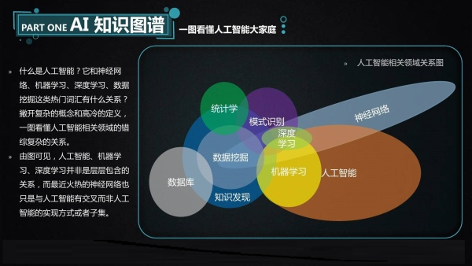
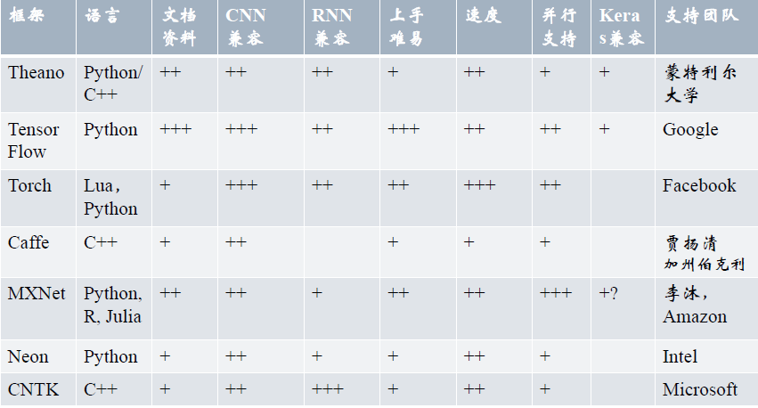

为了方便计算机软件协会成员学习机器学习这一科目，计算机软件协会机器学习方向小组特此整理了一份机器学习入门路径（以及学习资源）。

先讲一下最近人们都在讨论的话题：大数据、人工智能、机器学习、深度学习等名词的关系，有一张图解释的很清楚

乍一看这张图可能很复杂，不过不用担心，你只需要在其中一个小方向学的不错你未来就能有一个很棒的职业生涯。
事实上，人工智能的意思是让计算机习得像人类一样的思考方式，像人类一样智能的处理一切问题。而如今人工智能这一工程表现得最出色的技术实现部分便是机器学习，所以我们一般将机器学习描述为人工智能的技术实现。机器学习包括一些常用的统计学算法：逻辑回归、决策树、支持向量机、朴素贝叶斯等，而深度学习是机器学习当前表现得最好的一个阶段，深度学习中最棒的卷积神经网络、循环神经网络、长短期记忆网络等神经网络结构频繁的出现在我们的生活中，用于图像识别、自然语言处理、自动驾驶、语音识别、计算机写作等我们每天几乎都会用到的应用中。

# 一、数学基础
众所周知，机器学习是一门需要数学基础的科目，不过不用担心，你只需要了解到所用到的微积分、线性代数、概率论的一部分知识，不需要过度深入了解数学本身。

* **微积分**
大家经过大一的高等数学学习，导数相关的概念应该还没忘干净，如果有忘掉（或者从来没有学会过）的可以参照[麻省理工学院公开课：单变量微积分](http://open.163.com/special/sp/singlevariablecalculus.html)或者是其他的微积分教程
微积分的内容不需完全看完，导数、偏导数部分会求导即可，安心的看，这部分内容很简单。

* **线性代数**
机器学习中（特别是神经网络部分）包含着大量的矩阵运算，这时如果单纯的用循环来解决问题会极大影响效率，推荐需要熟悉线性代数中的矩阵的转置、矩阵相乘等部分内容（没开线性代数这门课的同学需自学）
这里给大家推荐一门网课[麻省理工公开课：线性代数](http://open.163.com/special/opencourse/daishu.html)
这门课可以说是这个星球上最棒的线性代数课之一了，如果你只想学习机器学习这一专业所用到的线代，认真学完前12课即可。

建议在上线性代数这门课的同学或者未来有考研意愿的同学在有精力的前提下多看两集，这位Gilbert Strang教授从线性代数本身来给大家传授这门科目。

# 二、机器学习算法
最近二十年，机器学习为我们带来了自动驾驶汽车、实用的语音识别、高效的网络搜索，让我们对人类基因的解读能力大大提高。当今机器学习技术已经非常普遍，你很可能在毫无察觉情况下每天使用几十次，像搜索引擎、购物网站的商品推荐功能，都是机器学习的应用。

关于机器学习，在百度百科上的解释是这样的：机器学习(Machine Learning, ML)是一门多领域交叉学科，

> 机器学习(Machine Learning, ML)是一门涉及概率论、统计学、逼近论、凸分析、算法复杂度理论等多门学科。专门研究计算机怎样模拟或实现人类的学习行为，以获取新的知识或技能，重新组织已有的知识结构使之不断改善自身的性能。

通俗一点来说， 机器学习是这样一个过程：**我们将一份数据集分成训练集和测试集两部分，将训练集扔进某一种统计机器学习的算法，获得一个用于预测的模型，然后我们在测试集上做验证，通过在测试集上的表现来改变各项参数，使得模型在测试集上表现得足够好。然后我们将一些模型从来没见过的数据（无论式训练集还是测试集）扔给模型，我们的模型好坏取决于在新的数据集上的预测准确程度。**

* **视频课程**
视频课程推荐大家学习人工智能这一行业开创者之一，著名的Andrew Ng吴恩达老师的机器学习课程
[Coursera地址](https://www.coursera.org/learn/machine-learning)
如果翻不了墙的小伙伴可以看[网易云版本](https://study.163.com/course/introduction/1004570029.htm)（内容一样）

* **书籍推荐**
书籍的话推荐从著名的西瓜书《[机器学习](https://book.douban.com/subject/26708119/)》入手，这本书用通俗易懂的方式给大家讲清机器学习中的多数算法，这也是学校里机器学习这门课程使用的课本。
另一本书叫做《[机器学习实战](https://book.douban.com/subject/24703171/)》，这上面除了讲解概念外，还附有各算法的python代码实现，这本书在学校的图书馆里有的。
此外，还有一本李航的《[统计学习方法](https://book.douban.com/subject/10590856/)》，此书系统而详细的介绍了统计学习的方法，如果你不明白统计学习这个词，你可以理解为是机器学习中内算法。
书的话可以选择自行购买，另外在社团的机器学习方向群里也有pdf版的。

# 三、语言
很多同学问过我，人工智能是不是用python实现的，对这个问题我的解释通常是：机器学习是人工智能的技术实现，而机器学习本体更多的是用算法的形式存在的，我们去实现机器学习这项任务时可以用到各种各类的工具，可以用python、java、c++、matlab或者scala，只不过python在数据分析数据处理时更具有优势，也更适合编程能力欠佳却想通过实现某些机器学习算法来解决现实中的一些问题的同学，毕竟学python是用天来计数的，而学c++是用年来计的。最重要的一点，现在开源的很多深度学习框架都极大程度的支持python。

这个表格列举的不是很全，还有几个著名的框架没有举出来，像Deeplearning4j,Keras等。

所以我推荐你们使用python语言来作为你学习这一学科的基础语言，无论是你需要调用开源的框架，或者是你要自己来手动实现某种算法，python都是不错的选择。事实上，学会python这门语言比你学会玩王者荣耀还要简单，任何人都可以在短时间内习得如何使用基础语法。
下面列一下python入门的一些学习资源：
* [廖雪峰的python教程](https://www.liaoxuefeng.com/wiki/0014316089557264a6b348958f449949df42a6d3a2e542c000)
廖雪峰老师的课程适合有一门其他编程语言基础的同学来学习。
* [Python 简介 | 菜鸟教程](http://www.runoob.com/python/python-intro.html)
如果没有编程基础的同学建议先过一遍Python最基本的知识，比如说：变量、数据结构、语法等，基础过的很快，基本上1~2周时间就能过完了。

**机器学习方向需要重点学习使用的三个库：**
* [NumPy](http://www.numpy.org/)
NumPy是使用Python进行科学计算的基础包。经过了长时间的发展，基本上成了绝大部分Python科学计算的基础包，当然也包括所有提供Python接口的深度学习框架。最重要的是，NumPy底层是c++实现的，你不需要忍受python语言漫长的解释过程。
* [Pandas](https://pandas.pydata.org/)
Pandas是一个矩阵运算的包，为Python编程语言提供高性能，易于使用的数据结构和数据分析工具。
* [matplotlib](https://matplotlib.org/)
Matplotlib是一个数据可视化库，你可以轻松地使用这个库来可视化你的数据，并通过图表的形式更好的理解数据本身的含义。

我推荐大家并行学习这三项机器学习所需的技能，你不需要等到万事都具备了才开始实践，你可以一边学习某一算法一边在你的比赛或者你的课程设计中应用这项技术，当你有哪一部分不太理解或者不懂的时候现查也没任何关系。《机器学习实战》中的例子可以帮你理解并运用你所学到的算法。

上文提到的相关书籍pdf资源我会放在协会的方向群里，对这一方向有兴趣的同学可以加群一起讨论学习
另外我们推荐大家在社团的论坛中[python部分](http://www.qudasai.top/bbs/forum.php?mod=forumdisplay&fid=41)讨论相关的问题，如果你遇到问题，在bbs中获得回答的速度可能会比你私聊别人要快一些。
计算机软件协会机器学习方向qq群：264872845