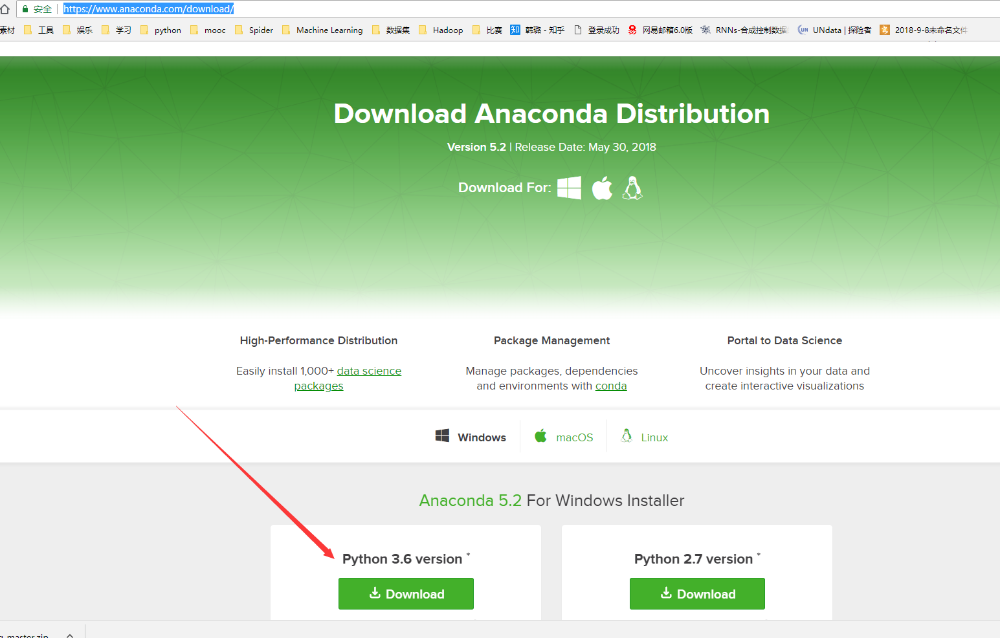
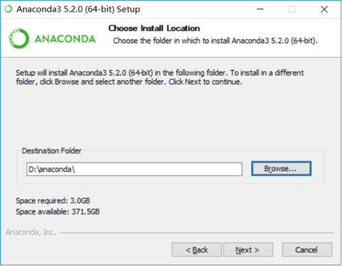
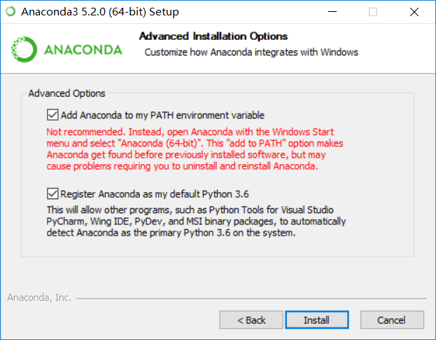
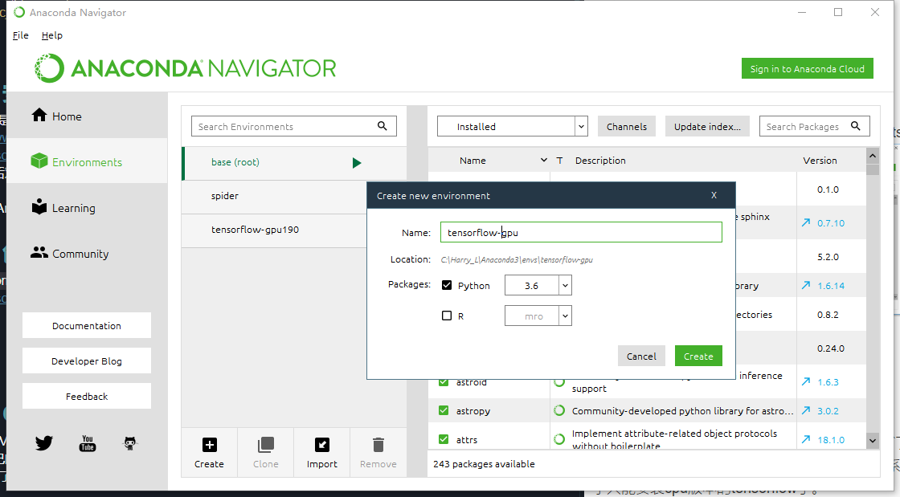
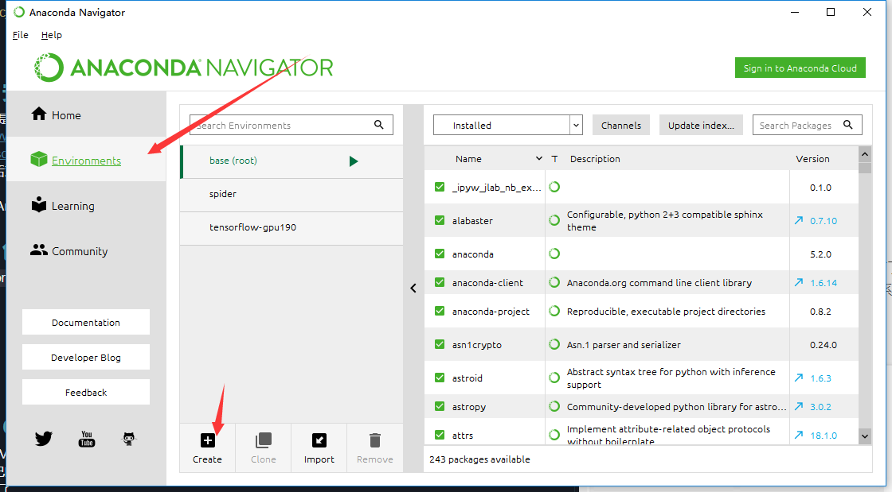
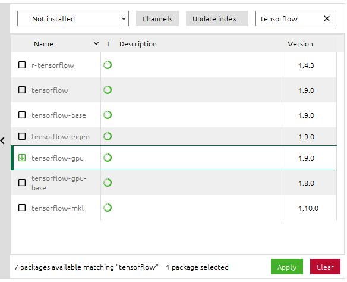
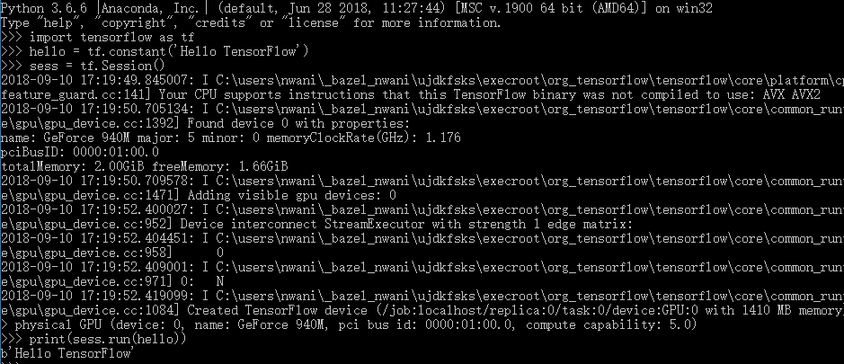

# 一、安装anaconda
anaconda是一个python\R的环境管理器，在anaconda的官网提供的[下载地址](https://www.anaconda.com/download/)选择下载python3.6版本

下载完成后双击文件打开，选择安装路径

勾选‘Add Anaconda to my PATH environment variable’复选框，这样以后就不需要手动添加环境路径



# 二、创建虚拟环境并安装tensorflow（GPU版本）
首先要确保自己笔记本的显卡是NVIDIA系列，tensorflow暂时不支持A卡，用A卡或者其他显卡的同学可以安装cpu版本。
打开anaconda的界面，选择左侧的Environments（环境），单击下方create（创建）

在环境安装初始配置完成后就可以单击进去按装tensorflow了


在右侧下拉框中选择"Not install",在搜索框中输入"tensorflow",**选择"tensorflow-gpu"**，单击右下角“apply”

安装过程可能会有些慢，需要多等一会。
# 三、创建虚拟环境并安装tensorflow（CPU版本）
* 如果你安装了gpu版本的tensorflow，跳过这一步

打开anaconda的界面，选择左侧的Environments（环境），单击下方create（创建）

在环境安装初始配置完成后就可以单击进去按装tensorflow了

在右侧下拉框中选择"Not install",在搜索框中输入"tensorflow",**选择"tensorflow"**，单击右下角“apply”

# 四、测试
按WIN+R进入“运行”，输入cmd，进去命令行，输入“activate 你的环境名称“，我们的环境名称是tensorflow-gpu，所以输入"activate tensorflow-gpu" 进入虚拟环境。
输入’python‘进入python，输入下列代码测试

``` python
import tensorflow as tf
hello = tf.constant('Hello, TensorFlow!')
sess = tf.Session()
print(sess.run(hello))
```
如果输出b’ Hello, TensorFlow!代表安装正确。

接下来就可以你的深度学习之旅了。
我们推荐大家在社团的论坛中[python部分](http://www.qudasai.top/bbs/forum.php?mod=forumdisplay&fid=41)讨论相关的问题，如果你遇到问题，在论坛中获得回答的速度可能会比你私聊别人要快一些。
计算机软件协会机器学习方向qq群：264872845

