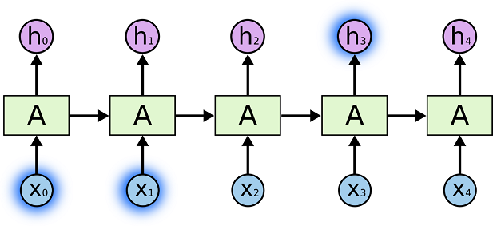

# 一、算法介绍
## 1.卷积神经网络
卷积神经网络(Convolutional Neural Network，CNN)，也叫做卷积网络，是一种专门用来出来具有类似网络结构的数据的神经网络。例如时间序列数据（可以认为是在时间轴上有规律地采样形成的一维网络）和图像数据（可以看作二维的像素网络）。卷积网络在诸多应用领域都表现优异。“卷积神经网络”一词表明该网络使用了卷积(Convolution)这种数学运算。卷积是一种特殊的线性运算。卷积网络是指那些至少在网络的一层中使用卷积运算来替代一般的矩阵乘法运算的神经网络。

## 1.1 卷积神经网络结构
卷积神经网络由输入层、卷积计算层、激活层、池化层、全连接层组成。
### 1.1.1数据输入层
本方案中数据输入曾层要做的处理主要是对原始图像数据进行预处理，其中包括：
　　•	去均值：把输入数据各个维度都中心化为0，如下图所示，其目的就是把样本的中心拉回到坐标系原点上。
　　•	归一化：幅度归一化到同样的范围，如下所示，即减少各维度数据取值范围的差异而带来的干扰，比如，我们有两个维度的特征A和B，A范围是0到10，而B范围是0到10000，如果直接使用这两个特征是有问题的，好的做法就是归一化，即A和B的数据都变为0到1的范围。
　　•	PCA/白化：用PCA降维；白化是对数据各个特征轴上的幅度归一化
### 1.1.2 卷积计算层
在这个卷积层，有两个关键操作：
　　•	局部关联。每个神经元看做一个滤波器(filter)
　　•	窗口(receptive field)滑动， filter对局部数据计算
卷积层中有三个卷积属性：深度、步长和填充值
](./images/1093303-20170430194425147-845167791.png)
### 1.1.3 激励层
把卷积层输出结果做非线性映射。CNN采用的激励函数一般为ReLU(The Rectified Linear Unit/修正线性单元)，它的特点是收敛快，求梯度简单，但较脆弱。

### 1.1.4 池化层
池化层夹在连续的卷积层中间， 用于压缩数据和参数的量，减小过拟合。
池化层的主要特征有三点：
*  特征不变性，也就是我们在图像处理中经常提到的特征的尺度不变性，池化操作就是图像的resize，平时一张狗的图像被缩小了一倍我们还能认出这是一张狗的照片，这说明这张图像中仍保留着狗最重要的特征，我们一看就能判断图像中画的是一只狗，图像压缩时去掉的信息只是一些无关紧要的信息，而留下的信息则是具有尺度不变性的特征，是最能表达图像的特征。

* 特征降维，我们知道一幅图像含有的信息是很大的，特征也很多，但是有些信息对于我们做图像任务时没有太多用途或者有重复，我们可以把这类冗余信息去除，把最重要的特征抽取出来，这也是池化操作的一大作用。

* 在一定程度上防止过拟合，更方便优化。

池化层中用的方法主要有最大值池化和平均值池化。本方案中使用最大值池化。

### 1.1. 5 全连接层
两层之间所有神经元都有权重连接，通常全连接层在卷积神经网络尾部。
## 2.长短时记忆网络
### 2.1循环神经网络结构
循环神经网络(Recurrent Neural Network, RNN)是一类用于处理序列数据的神经网络。就像卷积神经网络是专门用于处理网格化数据的神经网络，循环神经网络专门用于处理序列 x^{1}, ...... ,x^{T}的神经网络。正如卷积神经网络可以轻易的扩展到具有很大宽度和高度的图像，以及处理大小可变的图像，循环神经网络可以扩展到更长的序列（比不基于序列的特化网络长的多）。大多数循环网络也能处理可变长度的序列。

神经网络包含输入层、隐层、输出层，通过激活函数控制输出，层与层之间通过权值连接。激活函数是事先确定好的，那么神经网络模型通过训练“学“到的东西就蕴含在“权值“中。 基础的神经网络只在层与层之间建立了权连接，RNN最大的不同之处就是在层之间的神经元之间也建立的权连接。

这是一个标准的RNN结构图，图中每个箭头代表做一次变换，也就是说箭头连接带有权值。左侧是折叠起来的样子，右侧是展开的样子，左侧中h旁边的箭头代表此结构中的“循环“体现在隐层。 
在展开结构中我们可以观察到，在标准的RNN结构中，隐层的神经元之间也是带有权值的。也就是说，随着序列的不断推进，前面的隐层将会影响后面的隐层。图中O代表输出，y代表样本给出的确定值，L代表损失函数，我们可以看到，“损失“也是随着序列的推荐而不断积累的。 

除上述特点之外，标准RNN的还有以下特点： 
* 权值共享，图中的W全是相同的，U和V也一样。 
* 每一个输入值都只与它本身的那条路线建立权连接，不会和别的神经元连接。

以上是RNN的标准结构，然而在实际中这一种结构并不能解决所有问题，例如我们输入为一串车辆运行轨迹，输出为分类类别，那么输出就不需要一个序列，只需要单个输出。如图。 

  
标准RNN的前向输出流程如下所示：

各个符号的含义：x是输入，h是隐层单元，o为输出，L为损失函数，y为训练集的标签。这些元素右上角带的t代表t时刻的状态，其中需要注意的是，因策单元h在t时刻的表现不仅由此刻的输入决定，还受t时刻之前时刻的影响。V、W、U是权值，同一类型的权连接权值相同。
有了上面的理解，前向传播算法其实非常简单，对于t时刻： 

$$h^{(t)}=\phi (Ux^{(t)}+Wh^{(t-1)}+b)$$

其中ϕ()为激活函数，一般来说会选择tanh函数，b为偏置。

t时刻的输出就更为简单：
o^{t}=Vh^{t}+c
最终模型的预测输出为： 
\widehat{y}^{(t)}=\sigma (o^{(t)})
其中σ为激活函数，本次任务中RNN用于分类，故这里用softmax函数。

### 2.2 长短时记忆网络
  虽然标准的RNN可以在一定的情境中，根据输入序列得出输出序列，但是其可以获取的信息是有限的，这就制约了它被广泛运用。因为在使用过程中，普通RNN早期输入信号对隐藏层是由影响的，一方面可能会逐渐衰减；另一方面可能会逐渐增强直至溢出，即机器学习中常见的梯度消失问题。
  为了解决这个问题，人们提出了各种改进的RNN神经网络模型，有些研究人员提出不使用梯度下降算法（如模拟退火法和离散误差传播法），而采用时延方式等。在这些改进模型中，长短时记忆网络是最成功的一种。 
  长短时记忆网络(LSTM)是由一系列递归连接的记忆区域的自网络构成的，这些区块可以视为计算机中可微版的内存芯片。每个记忆区块中包含一个或多个记忆细胞和三个乘法单元：输入门、输出门和遗忘门，可以对记忆细胞进行连续的写、读和重置操作。
  传统的RNN网络在执行当前任务时，我们只需要查看最近的信息。在当前模型中，试图根据之前车辆运行状态预测接下来车辆的运行状态。如果我们想要预测短期范围内单个车辆的轨迹所带来的影响，我们不需要更多的参数。在这种情况下，如果相关信息与预测位置的间隔比较小，RNNs可以学会使用之前的信息。
  ](./images/5655a12a03a93.jpg)
  但我们也有需要更多参数的情况。考虑试图预测货车和小轿车在相同运动轨迹下所发生车祸的可能性。如果我们单纯的考虑车辆轨迹就不行了，我们需要根据车辆前期的运行状态、车辆的速度、车辆转弯或变道而产生的离心力和货车超载等情况。

不幸的是，随着这种影响因素的增加，RNN在预测上的表现不是那么的尽如人意。

从理论上讲，RNN绝对能够处理这样的“长期依赖关系”。一个人可以仔细挑选参数来解决这种简单的问题。不幸的是，实际上RNN不能够学习它们。

在这方面LSTM就没有这个问题。LSTMs明确设计成能够避免长期依赖关系问题。
  所有的递归神经网络都具有一连串重复神经网络模块的形式。在标准的RNNs中，这种重复模块有一种非常简单的结构，比如单个tanh层。
  
  
  
  LSTMs同样也有这种链状的结构，但是重复模块有着不同的结构。它有四层神经网络层以特殊的方式相互作用，而不是单个神经网络层。
  
  
 ### 2.3长短时记忆网络核心理念
 LSTMs的关键点是单元状态，就是穿过图中的水平线。
单元状态有点像是个传送带。它贯穿整个链条，只有一些小的线性相互作用。这很容易让信息以不变的方式向下流动。

LSTM有能力向单元状态中移除或添加信息，通过结构来仔细管理称为门限。
门限是有选择地让信息通过。它们由一个sigmoid神经网络层和逐点乘法运算组成。

sigmoid层输出0到1之间的数字，描述了每个成分应该通过门限的程度。0表示“不让任何成分通过”，而1表示“让所有成分通过”。
LSTM用三种这样的门限，来保护和控制单元状态。
LSTM中第一步是决定哪些信息需要从单元状态中抛弃。这项决策是由一个称为“遗忘门限层”的sigmoid层决定的。它接收和，然后为单元状态中的每个数字计算一个0到1之间的数字。1表示“完全保留”，而0则表示“完全抛弃”。
在本次预测任务中，试图根据前面的车辆信息以及车辆运动轨迹信息来预测下一时刻车辆是否会发生车祸。在这种问题中，单元状态可能包含当前车辆的车型，用来接下来判断车辆变道超车所带来的影响。当碰到一个新的车型时，我们希望它能够忘记旧车型。

](./images/5655a201d61f2.jpg)

接下来我们需要决定在单元状态中需要存储哪些新信息。这分为两个部分。首先，一个叫做“输入门限层”的sigmoid层决定哪些值需要更新。接下来，一个tanh层创建一个向量，包含新候选值，这些值可以添加到这个状态中。下一步我们将会结合这两者来创建一个状态更新。
在本次预测任务中，我们希望在单元状态中添加新车型，来替换我们忘记的旧车型。

现在来更新旧单元状态了，输入到新单元状态。之前的步骤已经决定了需要做哪些事情，我们只需要实现这些事情就行了。
我们在旧状态上乘以相应权重，忘记之前决定需要忘记的。然后我们加上新加入车型的权重，这就是新的候选值，它的规模取决于我们决定每个状态值需要更新多少。

最后，我们需要决定需要输出什么。这个输出将会建立在单元状态的基础上，但是个过滤版本。首先，我们运行一个sigmoid层来决定单元状态中哪些部分需要输出。然后我们将单元状态输入到tanh函数（将值转换成-1到1之间）中，然后乘以输出的sigmoid门限值，所以我们只输出了我们想要输出的那部分。

对于本次任务来说，因为它看到了两辆车辆的运动轨迹，它可能想输出与运动轨迹即将发生的事件相关的信息，为接下来出现的情况做准备。比如，它可能输出在超车过程中两车辆的车距比较近，那么我们知道接下来有可能发生因超车而产生的刮蹭。
# 二、实践方案
  使用了 UA-DETRAC（标注了 8250 个车辆 和 121万目标对象外框张标注过的车辆图片）作为数据集。使用卷积神经网络(Convolutional Neural Network，CNN)对其进行车辆检测模型的建立并进行交叉验证，得到一个能够对图片\视频中的车辆目标进行检测的模型。然后用562个高速公路摄像头下的车辆行驶视频，对其中的车辆运动轨迹进行特征处理，包括特征清洗，特征离散化，处理缺失值，对多维度特征进行PCA维，得到车辆运动时轨迹变化的时间序列。使用此时间序列做为数据集并划分训练集和测试集，利用长短时神经网络（Long Short Term Memory Network, LSTM）进行建模，得到一个根据车辆信息、路面情况、道路拥堵程度、视野可见度范围和车辆运动轨迹变化等因素来预测车辆是否会发生车祸。
